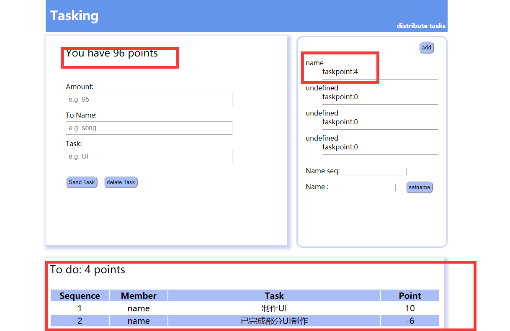

# Tasking——Dapp任务开发

## 一、选题背景

作为数据院学子，总是会参与很多的项目开发任务，除了代码能力之外，项目管理也应该是具备的一项技能，而团队之间的分工与记录是一个十分重要的环节，由此，此次区块链项目选题为分工记录软件——将区块链内的转账记为任务分工的途径，使用余额记录每个成员需要完成的任务点数，并在软件中记录每条任务的分配与完成状态。

github地址：https://github.com/SongXiaotong/BlockChain-distribute_task

## 二、软件介绍

### 【功能设置】

1. 给成员命名
2. 记录成员的任务点数；
3. 进行任务内容、任务对象、任务点数的分配
4. 将已经完成的任务删去，回收任务点
5. 记录每次任务添加及删除的信息

### 【使用与测试】

1. **启动软件**

   打开终端1，在code目录下使用命令行

   `truffle.cmd compile`

   打开终端2，在任意目录下使用命令行

   `ganalic-cli`

    回到终端1，在code目录下使用命令行

   `truffle.cmd migrate` 

   `npm run dev`

   打开浏览器输入localhost：8080

2. **balance**：显示一共有100个任务点，此为系统预设

   

3. **设置姓名**：一定要设置成员姓名：name seq处输入1-4，分别表示四个成员，name为新设的姓名

   

   设置过后可以发现姓名相应的位置又undefined变成新名字

   

4. **分配项目**：在左侧输入需要分配的任务点数、对象及任务内容，如分配给name（对象）制作ui的任务，任务点数为10，然后点击send task按钮，完成任务分配

   设置后可以发现，下方的列表的TO DO总数记为当前的待办点数，即10，表中记录了上方的操作，name的点数更改为所有需要完成的任务点数和，同时balance处做相应的修改

   

5. **删除项目**：在左侧输入需要删除的任务点数、对象及内容，如删除name的制作一部分ui的任务，任务点数为6，然后点击delete task按钮，完成任务分配

   设置后可以发现，下方的列表的TO DO总数减为剩余的4，表中记录了删除的操作，name的点数更改为剩余的4，同时balance处做相应的修改

   

6. **系统刷新**：刷新系统后，balance、列表、成员信息保留

   

## 三、 开发流程

### 【开发环境】

依赖环境：windows10终端

使用工具：truffle、geth、TestRCP、ganache-cli、nodejs、web3

### 【搭建步骤】

1. 安装工具

   `npm install -g truffle`

   `npm install -g ethereumjs-testRPC`

   `npm install -g web3` 

2. 初始化项目

   `truffle unbox webpack`

   

3. 修改app/index.html调整前端布局

4. 修改app/styles/app.css调整前端样式

   

5. 修改app/scripts/index.js文件调整前端运行逻辑

6. 使用相同的networkid进行geth控制台的进入和truffle的migrate部署，完成通过truffle在私有链上部署智能合约

## 四、 常见问题

1. 安装web3失败，显示无法加载visual studio building tools

   使用管理员打开命令行

    `npm install -global --production windows-build-tools` 

   如果还是不行就 （此前需要安装淘宝镜像）

   `npm install -g cnpm --registry=https://registry.npm.taobao.org` 

   `cnpm install node-gyp –save-dev` 

2. truffle compile和migrate命令运行时总弹出truffle.js代码界面

   修改命令为truffle.cmd compile和truffle.cmd migrate

3. 使用truffle部署合约时，报错显示没有解锁

   在进入geth客户端时增加

   --unlock "0xf93faaa11bb52c1543c61a114a387b271d3eb479" 

4. VM Exception while processing transaction: revert

   testrpc不能很好地处理拜占庭问题，所以要改用ganache-cli

5. gas用光

   首先，不应该使用string[]数组，应该使用mapping；所有查看的函数都加上view属性（constant），不会消耗gas

